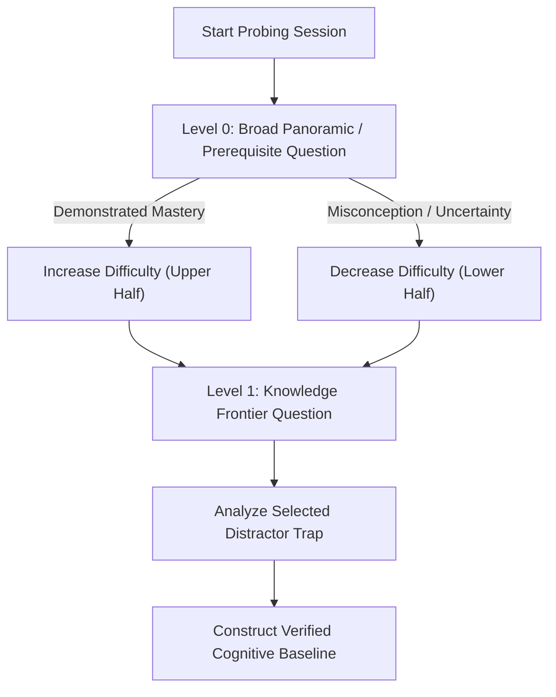

# Diagnostic Probing Skill

## Overview

The `diagnostic-probing` skill provides a surgical, structured assessment protocol to discover a learner's exact **edge of understanding** (*knowledge boundary*). Instead of delivering arbitrary pre-tests or assuming baseline competency, this skill applies a conceptual **binary search algorithm** coupled with diagnostic multiple-choice questions designed around classic cognitive misconceptions.



---

## When to Use This Skill

- At the beginning of any complex technical tutorial, mentorship session, or explanation.
- When determining the starting point for a curriculum without wasting time re-teaching known concepts or presenting material beyond the student's reach.
- When diagnosing why a learner is struggling with an advanced topic by tracing back to foundational misconceptions.
- When preparing an active learning plan for topics in mathematics, physics, engineering, or computer science.

## Do Not Use This Skill When

- The learner is looking for an immediate syntax lookup or direct answer to a one-off question.
- The interaction is a formal exam or grading session where diagnostic feedback is not desired.
- The topic is purely subjective or opinion-based without definitive prerequisite hierarchies.

---

## The Diagnostic Probing Protocol

### 1. Conceptual Binary Search

Rather than testing every prerequisite linearly, traverse the dependency tree hierarchically:

1. **Broad Macro-Test:** Present a foundational question at the midpoint of the prerequisite chain.
2. **Directional Branching:**
   - **Pass with confidence:** Eliminate the bottom 50% of the hierarchy and test the midpoint of the upper tier.
   - **Fail or hesitate:** Narrow down to identify the earliest missing foundational link in the bottom tier.
3. **Boundary Convergence:** Within 2 to 4 questions, converge upon the exact threshold where the learner's comprehension begins to break down.

---

### 2. Diagnostic Question Architecture

Every diagnostic question must be crafted with intentional, high-signal options:

```
[Context / Short Scenario]
[Core Diagnostic Question]

A) [Plausible Option: Distractor revealing Misconception 1 (e.g., Overgeneralization)]
B) [Plausible Option: Distractor revealing Misconception 2 (e.g., Conflation of terms)]
C) [Plausible Option: Distractor revealing Misconception 3 (e.g., Operational/Sign error)]
D) [Correct Answer: Requires sound conceptual understanding]

Prompt: "Select an option and explain in a single sentence why you chose it."
```

#### Key Rules for Diagnostic Options:
- **No Giveaway Distractors:** Avoid obviously silly or irrelevant options.
- **Classify the Error:** Every incorrect option must directly identify a specific cognitive trap (e.g., confusing covariant and contravariant transformation laws).
- **Require Justification:** Always request a one-sentence rationale to distinguish true conceptual mastery from lucky guessing.

---

### 3. The Knowledge Boundary Output Schema

Upon concluding the probing phase, summarize the diagnostic profile clearly:

```markdown
### 📊 Knowledge Boundary Diagnostic Profile

- **Mastered Baseline:** [Concepts and tools where the learner demonstrated fluent understanding].
- **Active Frontier (Boundary):** [The exact threshold where misconceptions or hesitation emerged].
- **Identified Gaps:** [Specific cognitive traps revealed by selected distractors].
- **Recommended Entry Node:** [The exact node in the curriculum or DAG where teaching should begin].
```

---

## Best Practices

1. **Keep it Encouraging and Low-Stakes:** Frame probing as a mental warm-up, not a stressful test.
2. **Do Not Teach During Probing:** Resist the temptation to immediately deliver full lectures when a student misses a question. Acknowledge the choice, record the diagnostic signal, and reserve the full explanation for the teaching phase.
3. **Acknowledge Partial Intuitions:** If the student picks the wrong option but articulates partial reasoning, note the exact nuance they grasped.

---

## Limitations

- Diagnostic accuracy depends on the learner providing genuine reasoning alongside their option choice; arbitrary guessing without justification can mask boundary signals.
- Designed for hierarchical, technical domains (math, CS, engineering, science); less effective for unstructured, subjective, or non-hierarchical creative topics.
- Probing is bounded to 2-4 questions to avoid cognitive fatigue and does not replace exhaustive formal exams.

---

## Common Pitfalls

- **Leading Questions:** Phrasing questions that unintentionally give away the correct answer.
- **Over-Testing:** Asking more than 4 diagnostic questions in a single probing session, fatiguing the student.
- **Ignoring the "Why":** Scoring only binary right/wrong answers without evaluating the student's underlying reasoning.
