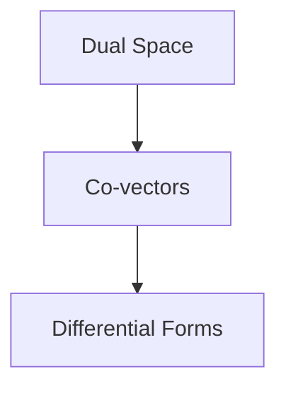
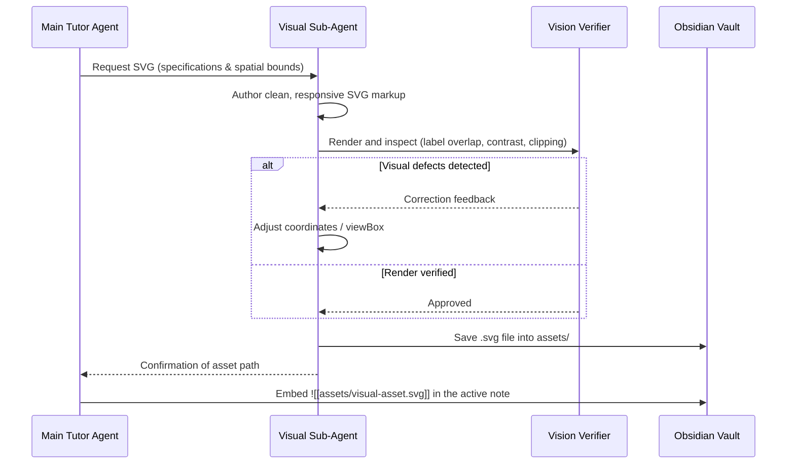

# Obsidian Learning Harness Skill

## Overview

The `obsidian-learning-harness` skill establishes a local technical runtime (*the Harness*) that connects an AI learning session directly to an Obsidian vault. It coordinates live session logging in Markdown, native LaTeX mathematical typesetting, and autonomous sub-agent loops for generating and verifying visual assets (SVGs).

```mermaid
flowchart LR
    subgraph Agent["AI Tutor Session"]
        Tutor[Tutor Core]
        SubAgent[Visual Asset Sub-Agent]
    end

    subgraph Harness["Obsidian Harness Interface"]
        Log["MD Log / Live Session Note (.md)"]
        SVG["Generated SVG Asset"]
    end

    subgraph Obsidian["Obsidian Vault"]
        Note["Note with LaTeX + Mermaid + SVG Embeds"]
    end

    Tutor -->|Writes Explanations & Quizzes| Log
    Tutor -->|Spawns Visual Generation| SubAgent
    SubAgent -->|Vision Verification Loop| SVG
    SVG -->|Automatic Embed ![[...]]| Log
    Log --> Note
```

---

## When to Use This Skill

- When conducting an active technical study or tutoring session in Obsidian.
- When generating comprehensive mathematical notes requiring rigorous LaTeX / KaTeX rendering ($$...$$).
- When a concept requires custom visual illustrations (SVGs, coordinate planes, vector fields, neural architectures) created and verified on the fly.
- When organizing persistent learning logs, session notes, and linked concept maps in a Personal Knowledge Management (PKM) system.

## Do Not Use This Skill When

- The user is working in a plain text editor without Obsidian or Markdown rendering capabilities.
- The task does not involve persistent note generation or visual assets.

---

## Technical Harness Components

### 1. Real-Time Session Logging (.md / MD Log)

All active learning interactions should be appended sequentially into a clean, well-structured Obsidian note:

```markdown
---
title: "Session: Differential Forms and Co-vectors"
date: 2026-08-31
tags: [mathematics, mathematical-physics, active-learning]
status: in-progress
---

# 🧠 Learning Session: [Topic Name]

> [!ABSTRACT] Session Objective
> [Concise summary of the learning goal and target outcome].

## 🗺️ Dependency Graph (DAG)



---

## 📌 Node 1: [Current Concept]
[Concise single-step explanation focused on atomic intuition]

> [!QUESTION] Checkpoint Mini-Quiz
> [Active diagnostic question with calibrated options]
```

---

### 2. LaTeX Mathematical Typesetting Standards

Ensure all mathematical expressions adhere to standard KaTeX/MathJax syntax supported natively in Obsidian:

- **Inline math:** Enclose between single dollar signs `$f(x) = \nabla \phi$`.
- **Display equations:** Enclose between double dollar signs:
  $$\omega = \sum_{i=1}^{n} a_i(x)\,dx^i$$
- **Matrices & Aligned Steps:** Use `\begin{aligned} ... \end{aligned}` or `\begin{pmatrix} ... \end{pmatrix}` blocks.
- **Vectors and Forms:** Use standard geometric notation ($\mathbf{v} \in V$, $\alpha \in V^*$, $\langle \alpha, \mathbf{v} \rangle$).

---

### 3. Visual Asset Sub-Agent Loop (SVG Generation & Vision Check)

When spatial, geometric, or schematic intuition is needed, deploy a specialized sub-agent to generate custom SVG illustrations:



#### SVG Generation Invariants:
1. **Responsive ViewBox:** Always define `viewBox="0 0 W H"` without hardcoded fixed container dimensions.
2. **Accessible Contrast:** Use high-contrast color palettes with clear stroke widths (`stroke-width="2"` or `"3"`).
3. **Clean Typography:** Use system sans-serif fonts (`font-family="system-ui, sans-serif"`) with ample padding around text labels to prevent clipping.

---

## Best Practices

1. **Keep Notes Modular:** Link related concepts using Obsidian wikilinks `[[Related Concept]]` for graph view navigation.
2. **Use Callouts for Cognitive Anchors:**
   - `> [!NOTE]` for definitions.
   - `> [!WARNING]` for common traps and misconceptions.
   - `> [!EXAMPLE]` for concrete calculations.
3. **Persist Progress:** Maintain checkbox status (`- [x] Completed`) in the learning log so subsequent sessions resume from the exact active node.

---

## Limitations

- Full rendering requires an environment supporting Obsidian Flavored Markdown, MathJax/KaTeX, and Mermaid.
- Visual sub-agent SVG generation requires multimodal/vision verification support to inspect rendered outputs autonomously.
- Real-time logging requires local file system write access to the target vault directory.

---

## Common Pitfalls

- **Broken LaTeX Delimiters:** Leaving empty spaces next to dollar signs (e.g. `$ x $`), which can break Obsidian LaTeX parsing. Always format tightly as `$x$`.
- **Bloated SVG Dimensions:** Creating unscaled canvas sizes that cause horizontal scrollbars inside Obsidian reading view.
